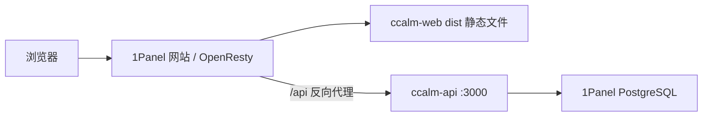

# CCALM 管理系统（React + Vite + NestJS）

项目采用 pnpm workspace 管理：

```text
ccalm-system/
  ccalm-web/  # React + Vite 前端
  ccalm-api/  # NestJS + Prisma 后端
```

## 本地开发

确保本机 PostgreSQL 已启动，且数据库已创建，例如 `ccalm_system`。

### 1) 配置后端

在 `ccalm-api/.env` 配置数据库与 JWT：

```env
PORT=3000
DATABASE_URL="postgresql://ccalm:<你的密码>@localhost:5432/ccalm_system?schema=public"
JWT_SECRET="change_me"
```

初始化数据库并启动后端：

```bash
pnpm install
cd ccalm-api
pnpm exec prisma generate
pnpm exec prisma migrate dev
pnpm run start:dev
```

首次部署需在数据库中自行插入至少一名 `role` 为 `admin` 的用户（例如用 `pnpm exec prisma studio` 或 SQL），否则无法登录后台管理人员。

### 2) 启动前端

```bash
cd ccalm-web
pnpm dev
```

访问：

- 前端：`http://localhost:5173/`
- 后端：`http://localhost:3000/api`

### 3) 页面入口

- `/login`：登录
- `/`：考勤主页面
- `/users`：人员管理（仅管理员可见入口）

添加 UI 组件时进入前端目录执行：`cd ccalm-web && pnpm dlx shadcn@latest add <组件名>`。

## 1Panel 部署流程（推荐）

推荐在 1Panel 中这样部署：PostgreSQL 用 1Panel 应用商店安装，前端由 1Panel 网站/OpenResty 托管 `ccalm-web/dist` 静态文件，后端 `ccalm-api` 用 Node.js + PM2 守护，网站把 `/api` 反向代理到后端端口。



### 1) 安装 PostgreSQL

在 1Panel「应用商店」安装 PostgreSQL，创建数据库和用户，例如：

- 数据库名：`ccalm_system`
- 用户名：`ccalm`
- 密码：使用 1Panel 生成的强密码

记下 PostgreSQL 的连接地址、端口、用户名、密码。若后端直接运行在宿主机，通常可使用 `127.0.0.1` 和应用暴露端口；若 1Panel 给出了容器内服务名或映射端口，以 1Panel 页面显示为准。

### 2) 准备 Node.js、pnpm、PM2

在 1Panel「运行环境」安装 Node.js 20，或在服务器终端安装：

```bash
node -v
npm i -g pnpm pm2
pnpm -v
pm2 -v
```

### 3) 拉取项目

建议把项目放到 1Panel 网站目录之外，例如 `/opt/ccalm-system`：

```bash
cd /opt
git clone https://github.com/ccalm952/ccalm-system.git ccalm-system
cd ccalm-system
pnpm install
```

如果目录已存在，使用 `git pull` 更新即可。

### 4) 配置生产环境变量

前端生产环境：`ccalm-web/.env`

```env
VITE_API_BASE=/api
VITE_AMAP_KEY=
VITE_AMAP_SECURITY_JS_CODE=
```

同域部署时建议使用 `VITE_API_BASE=/api`，由 1Panel 网站反向代理到后端，避免跨域配置复杂化。

后端生产环境：`ccalm-api/.env`

```env
PORT=3000
DATABASE_URL="postgresql://ccalm:<数据库密码>@127.0.0.1:5432/ccalm_system?schema=public"
JWT_SECRET="<替换为高强度随机字符串>"
```

不要提交真实 `.env`。`JWT_SECRET` 建议使用至少 32 位随机字符串。

### 5) 初始化数据库

```bash
cd /opt/ccalm-system/ccalm-api
pnpm exec prisma generate
pnpm exec prisma migrate deploy
```

首次部署请确保数据库里至少有 1 个 `role=admin` 的用户，否则无法登录后台管理人员。可以用 1Panel 数据库管理工具、Prisma Studio 或 SQL 初始化。

### 6) 构建前后端

```bash
cd /opt/ccalm-system
pnpm build
```

- 前端产物目录：`/opt/ccalm-system/ccalm-web/dist`
- 1Panel 网站根目录示例：`/opt/1panel/www/sites/www.ccalm.xyz/index`
- 后端产物入口：`/opt/ccalm-system/ccalm-api/dist/src/main.js`

### 7) 启动后端

```bash
cd /opt/ccalm-system/ccalm-api
pm2 start dist/src/main.js --name ccalm-api
pm2 save
pm2 startup
```

查看状态和日志：

```bash
pm2 status
pm2 logs ccalm-api
curl -i http://127.0.0.1:3000/api/auth/me
```

后端接口本机地址应为：`http://127.0.0.1:3000/api`，上传头像等静态文件地址应为：`http://127.0.0.1:3000/api/uploads/...`。未登录时访问 `/api/auth/me` 返回 `401` 属于正常，连接失败才说明后端没有启动成功。

### 8) 配置 1Panel 网站

在 1Panel「网站」中新建站点：

- 类型：静态网站
- 主目录：`/opt/1panel/www/sites/www.ccalm.xyz/index`（或你的实际网站目录）
- 运行目录：`/`
- 默认文档：`index.html`
- HTTPS：绑定域名后申请证书并开启强制 HTTPS

构建前端后，把 `dist` 内容复制到网站根目录：

```bash
cd /opt/ccalm-system
pnpm --dir ccalm-web build
rm -rf /opt/1panel/www/sites/www.ccalm.xyz/index/*
cp -r ccalm-web/dist/* /opt/1panel/www/sites/www.ccalm.xyz/index/
```

在站点的 OpenResty/Nginx 配置中确保前端路由回退到 `index.html`：

```nginx
location / {
  try_files $uri $uri/ /index.html;
}
```

再新增 `/api` 反向代理：

```nginx
location /api/ {
  proxy_pass http://127.0.0.1:3000;
  proxy_http_version 1.1;
  proxy_set_header Host $host;
  proxy_set_header X-Real-IP $remote_addr;
  proxy_set_header X-Forwarded-For $proxy_add_x_forwarded_for;
  proxy_set_header X-Forwarded-Proto $scheme;
}
```

保存后在 1Panel 中重载 OpenResty。访问 `https://<你的域名>/login` 验证页面，访问 `https://<你的域名>/api/auth/me` 应返回未登录或未授权响应，而不是 404。

### 9) 更新发布流程

```bash
cd /opt/ccalm-system
git pull https://github.com/ccalm952/ccalm-system master
pnpm install

cd ccalm-api
pnpm -C ../packages/attendance-core build
pnpm exec prisma generate
pnpm exec prisma migrate deploy
pnpm run build
pm2 restart ccalm-api

cd ../ccalm-web
pnpm build
rm -rf /opt/1panel/www/sites/www.ccalm.xyz/index/*
cp -r dist/* /opt/1panel/www/sites/www.ccalm.xyz/index/

pm2 save
```

如果只改了前端，通常只需要在 `ccalm-web` 执行 `pnpm build` 并把新的 `dist` 内容复制到网站根目录；如果改了数据库 schema，必须在 `ccalm-api` 执行 `pnpm exec prisma migrate deploy`。

### 10) 常见排查

- 后端起不来：先看 `pm2 logs ccalm-api`，重点检查 `ccalm-api/.env`、`DATABASE_URL`、`JWT_SECRET`。
- 数据库连不上：确认 1Panel PostgreSQL 端口、账号、密码、数据库名和 `DATABASE_URL` 完全一致。
- 前端页面空白：确认 1Panel 网站主目录指向 `/opt/1panel/www/sites/www.ccalm.xyz/index`，并且已把最新 `ccalm-web/dist` 内容复制进去。
- 前端请求 `localhost:3000`：确认 `ccalm-web/.env` 或 `ccalm-web/.env.production` 为 `VITE_API_BASE=/api`，并重新执行 `pnpm build` 后复制新的 `dist` 到网站根目录。
- 刷新子页面 404：确认网站配置里有 `try_files $uri $uri/ /index.html;`。
- 接口 404：确认 `/api/` 反向代理到 `http://127.0.0.1:3000`，后端代码已设置全局前缀 `/api`。
- 接口 502：先在服务器执行 `curl -i http://127.0.0.1:3000/api/auth/me`。如果连接失败，检查 `pm2 logs ccalm-api`，并确认 PM2 启动入口是 `ccalm-api/dist/src/main.js`。如果本机返回 `401` 但网站仍 `502`，检查 OpenResty 是否在容器中，必要时把反代地址从 `127.0.0.1` 改为服务器内网 IP。
- 登录接口跨域：同域部署时前端应使用 `VITE_API_BASE=/api`，不要写成另一个域名。
- 地图不可用：检查 `VITE_AMAP_KEY` 和 `VITE_AMAP_SECURITY_JS_CODE`，并在高德控制台配置生产域名白名单。

## 手动部署参考（Ubuntu + Nginx + PM2）

不用 1Panel 时，也可以沿用同样思路：Nginx 托管 `ccalm-web/dist`，`/api` 反代到 `127.0.0.1:3000`，后端用 PM2 启动 `ccalm-api/dist/src/main.js`。
